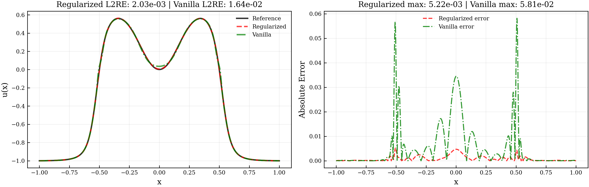
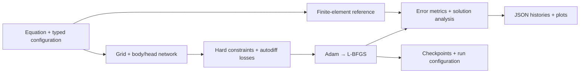
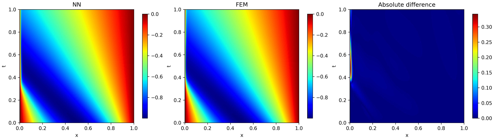
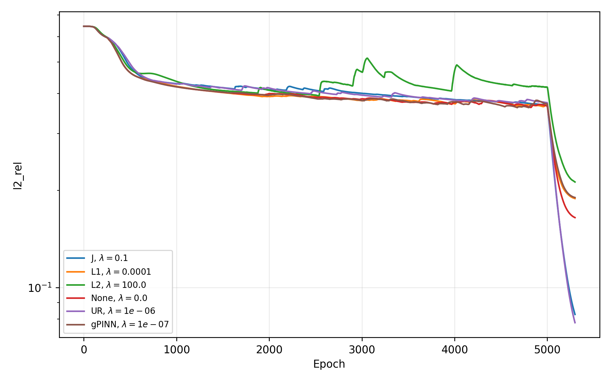

<div align="center">

  <h1>Regularization in Physics-Informed Neural Networks</h1>
  <p><strong>Python 3.12 · PyTorch · NeuroDiffEq · scikit-fem</strong></p>
  <p>
    <a href="#results">Explore the results</a>
    · <a href="#engineering-highlights">See the engineering</a>
    · <a href="#getting-started">Run locally</a>
    · <a href="Bachelor%20Ilnytskyi%20Davyd.pdf">Read the thesis</a>
  </p>

</div>

A configurable PyTorch research pipeline for solving nonlinear PDEs and measuring which regularization methods improve accuracy. The work focuses on higher-order automatic differentiation, custom optimization loops, finite-element validation, and reproducible benchmarking.

> **Bachelor’s thesis by [Davyd Ilnytskyi](https://www.linkedin.com/in/davyd-ilnytskyi/)**<br>
> Ukrainian Catholic University · **2026**



*Regularization improves the approximation around sharp transitions. This individual Allen–Cahn run compares L1 regularization with a vanilla PINN at t = 0.5; the right panel exposes errors that are hard to see in the solution curves. Extracted from thesis Figure 5.8. Results across five seeds are reported below.*

## The problem

A physics-informed neural network (PINN) learns a continuous solution to a differential equation by minimizing how much its predictions violate that equation. This makes it possible to train from the governing physics, initial conditions, and boundary conditions, without a labeled solution dataset.

The challenge is training reliably: a small physics residual does not necessarily mean an accurate solution, especially near steep gradients. This project investigates whether regularization can improve solution quality while keeping the network architecture and training setup fixed within each benchmark.

The pipeline covers equation definition, model construction, automatic differentiation, training, numerical reference solutions, coefficient sweeps, checkpointing, and visual analysis. The three benchmarks are **Burgers’** (nonlinear transport), **Allen–Cahn** (phase separation), and **Fisher–KPP** (reaction–diffusion).

## Results

The table reports **mean ± standard deviation of relative L2 error over five independent seeds** (46–50), evaluated against finite-element reference solutions at **t = 0.5** on a spatial grid with **Δx = 10⁻⁴**. Lower is better.

| Benchmark | Vanilla PINN | Best mean result | Method | Reduction in mean error |
| :--- | ---: | ---: | :--- | ---: |
| Burgers’ | 1.4 × 10⁻¹ ± 1.3 × 10⁻² | **5.5 × 10⁻² ± 2.0 × 10⁻²** | Unimodular regularization | **≈61%** |
| Allen–Cahn | 1.3 × 10⁻² ± 2.1 × 10⁻³ | **6.2 × 10⁻³ ± 1.0 × 10⁻³** | L1 | **≈52%** |
| Fisher–KPP | 1.9 × 10⁻⁵ ± 1.3 × 10⁻⁵ | **1.2 × 10⁻⁵ ± 9.4 × 10⁻⁶** | Gradient-enhanced PINN | **≈37%** |

*Source: [thesis](Bachelor%20Ilnytskyi%20Davyd.pdf), Tables 5.5–5.7. Reductions are calculated from the rounded reported means as `(vanilla − regularized) / vanilla`; they are descriptive comparisons, not significance tests.*

**The main finding: the best regularizer depends on the equation.** UR and Jacobian regularization lead on Burgers’, while simple L1/L2 penalties perform best on Allen–Cahn. Some methods underperform the vanilla baseline, so selecting the method and its coefficient is part of the problem.

<details>
<summary><strong>Experimental protocol and all six configurations</strong></summary>

| Method | Burgers’ | Allen–Cahn | Fisher–KPP |
| :--- | ---: | ---: | ---: |
| Vanilla | 1.4 × 10⁻¹ ± 1.3 × 10⁻² | 1.3 × 10⁻² ± 2.1 × 10⁻³ | 1.9 × 10⁻⁵ ± 1.3 × 10⁻⁵ |
| L1 | 1.5 × 10⁻¹ ± 1.7 × 10⁻² | **6.2 × 10⁻³ ± 1.0 × 10⁻³** | 1.4 × 10⁻⁵ ± 3.8 × 10⁻⁶ |
| L2 | 1.6 × 10⁻¹ ± 6.2 × 10⁻² | 6.3 × 10⁻³ ± 2.3 × 10⁻³ | 1.7 × 10⁻⁵ ± 6.3 × 10⁻⁶ |
| Jacobian (JR) | 6.1 × 10⁻² ± 4.2 × 10⁻² | 1.5 × 10⁻² ± 9.2 × 10⁻³ | 3.8 × 10⁻⁵ ± 2.8 × 10⁻⁵ |
| Unimodular (UR) | **5.5 × 10⁻² ± 2.0 × 10⁻²** | 2.2 × 10⁻² ± 5.7 × 10⁻³ | 6.7 × 10⁻⁵ ± 2.1 × 10⁻⁵ |
| Gradient-enhanced (gPINN) | 1.5 × 10⁻¹ ± 1.3 × 10⁻² | 3.0 × 10⁻¹ ± 8.8 × 10⁻² | **1.2 × 10⁻⁵ ± 9.4 × 10⁻⁶** |

- **153 coefficient-search runs:** three equations × (five methods × ten coefficients + one baseline), with coefficients from 10⁻⁷ to 10².
- **90 comparison runs:** three equations × six configurations × five seeds, using the selected coefficients.
- **18 final evaluation runs:** three equations × six configurations for solution and error analysis.
- **Controlled initialization:** each method within an equation/seed comparison starts from the same saved network weights; architecture, collocation grid, and optimizer settings are held fixed.
- **Optimization:** 5,000 Adam epochs followed by 150 L-BFGS epochs during coefficient search, or 300 during the subsequent comparisons.
- **Compute:** approximately 104 GPU-hours on an NVIDIA A40 through Slurm; each job requested four CPU cores and 64 GB RAM. Development and exploratory work used Google Colab with a T4. These figures are documented in thesis Appendix B; cluster job scripts are not included in this checkout.

The quantitative study uses one active head with fixed equation parameters and initial/boundary conditions. Five seeds characterize variability within these configurations; the results do not establish a universal ranking across PDEs or architectures.

</details>

## Engineering highlights

### Differentiating through the physics and the regularizer

The custom [`MHSolver2D`](src/mh_solver.py) extends NeuroDiffEq’s solver with separate residual and regularization losses. PyTorch autograd builds differentiable graphs for PDE derivatives and the additional penalties, allowing the entire objective to train jointly.

| Method | Implemented computation |
| :--- | :--- |
| **Jacobian regularization** | Computes the body representation’s Jacobian with respect to its inputs, component by component with `create_graph=True`, and penalizes its mean squared entries. |
| **Unimodular regularization** | Constructs the induced metric from latent-feature derivatives and evaluates its determinant to penalize geometric distortion. |
| **Gradient-enhanced PINN** | Differentiates PDE residuals with respect to the input coordinates and equation parameter. For these second-order PDEs, this requires higher-order differentiation through the network. |
| **L1 / L2** | Applies absolute-value or squared-weight penalties to the body network’s final linear layer in the current implementation. |

Regularization strength and call frequency are configurable. The thesis explores Jacobian regularization in this PINN setting alongside established derivative-based approaches and simpler norm penalties.

### A custom training loop for Adam and L-BFGS

Training supports Adam, L-BFGS, or a sequential Adam → L-BFGS schedule. The solver handles repeated L-BFGS closure evaluations, accumulates losses across heads, and reuses the sampled batches within an optimizer step. Shared body parameters are deduplicated before constructing the optimizer.

The experiment runner coordinates learning-rate warmup and decay, switches optimizers between phases, and saves model and optimizer state. These details matter when adding higher-order derivative losses to an optimizer that can reevaluate the objective several times per step. See [`mh_solver.py`](src/mh_solver.py), [`equation_setup.py`](src/equation_setup.py), and [`io_model.py`](src/io_model.py).

### Constraints enforced by construction

The network maps spatial coordinates, time, and an equation parameter through a shared MLP body, a latent basis, and a solution head. A custom [`BundleIBVP1D`](src/neurodiffeqq.py) transforms the output to satisfy the benchmark initial and Dirichlet boundary conditions by construction, avoiding separate boundary-loss weights.

The model builders also expose multiple heads, optional Fourier feature encoding, configurable initialization, and body/head weight loading. The reported thesis comparison uses a single head and the standard coordinate input; the broader framework provides room for further experiments.

### Independent numerical validation and traceable experiments

[`numerical_solvers.py`](src/numerical_solvers.py) implements finite-element reference solvers for all three PDEs using scikit-fem: linear spatial elements, mass and diffusion matrices, time stepping, and boundary-value enforcement. These references are used for evaluation; the PINN training objective uses the governing equation and regularization.

Typed configuration dataclasses separate equation definitions, domains, networks, optimizers, evaluation, and I/O. Each run records its configuration and metric histories; helper utilities seed Python, NumPy, and PyTorch and capture package/CUDA environment information. Evaluation callbacks track relative L2 error, MSE, MAE, and convergence thresholds.



## Visual validation



*Burgers’ equation with Jacobian regularization: prediction, FEM reference, and absolute error across space and time. The error map reveals the remaining difficulty near the steep boundary region. Extracted from thesis Figure 5.6(c).*

<details>
<summary><strong>Training dynamics: the effect of switching optimizers</strong></summary>



*Mean relative L2 error over five runs, with EMA smoothing (α = 0.01). The sharp decrease after epoch 5,000 coincides with the Adam → L-BFGS transition. Extracted from thesis Figure 5.1(f).*

</details>

All figures are extracted from the thesis. [Figure provenance and extraction commands](docs/figures/README.md).

## Technology stack

| Area | Technologies and use |
| :--- | :--- |
| Language & configuration | **Python 3.12**, type hints, dataclasses, callable equation definitions |
| Deep learning | **PyTorch**, autograd, MLPs, Adam, L-BFGS, learning-rate schedulers |
| Scientific computing | **NeuroDiffEq**, **scikit-fem**, **NumPy**, **SciPy** |
| Analysis & visualization | **Matplotlib**, **Seaborn**, solution/error heatmaps, training curves, EMA |
| Experiment workflow | **Jupyter**, **Google Colab**, JSON metrics, PyTorch checkpoints, environment snapshots |
| Thesis compute environment | **CUDA**, **NVIDIA A40 / T4**, **Slurm** HPC jobs |

## Getting started

### Set up the environment

The notebook records Python **3.12.13**. From the repository root:

```bash
conda create -n pinns_regularization python=3.12.13
conda activate pinns_regularization
python -m pip install -r requirements.txt
python -m pip install jupyterlab
python -m jupyterlab
```

### Explore the saved experiments

Open [`main.ipynb`](main.ipynb). The notebook loads trained checkpoints, compares predictions with FEM references, and exports solution plots and heatmap data.

1. Download `david_finall.zip` from the [checkpoint archive folder](https://drive.google.com/drive/u/2/folders/1HfgJVsFKKbwP-TZyCgTfFjVh5DxcILue) linked in the notebook and place it in the repository root.
2. Run the initialization cells and the archive-extraction cell. The plotting cells expect checkpoints beneath `final_model_states/david_finall/`.
3. Run the equation-specific plotting sections. Outputs include `final_plots/` and `heatmaps.json`.

The current notebook is configured for checkpoint inspection, with a one-epoch L-BFGS setup used to construct each solver before loading its saved model. Its defaults are not the full thesis training schedule. On Colab, upload or clone the repository and set the working directory before importing `src`; update the notebook’s personal Drive path for your account.

<details>
<summary><strong>Train a small experiment without downloading checkpoints</strong></summary>

Run this in a new notebook from the repository root. It compares a vanilla Fisher–KPP model with a gPINN using the same initial weights. The deliberately small grid and 20-epoch budget demonstrate the API; they do not reproduce the thesis accuracy.

```python
import sys
sys.path.insert(0, "./src")

from data_classes import (
    DomainConfig, EquationSpec, EvalConfig, NetworkConfig,
    OptimizerConfig, SchedulerConfig, TrainConfig,
)
from equation_setup import (
    fisher_ic, fisher_kpp_equation,
    make_fisher_bc_left, make_fisher_bc_right,
    make_run_config, register_equation, run_experiment,
)
from numerical_solvers import solve_fisher_kpp

register_equation(EquationSpec(
    name="fisher",
    equation_factory=fisher_kpp_equation,
    ic_fn=fisher_ic,
    bc_left_builder=make_fisher_bc_left,
    bc_right_builder=make_fisher_bc_right,
    numerical_solution_func=solve_fisher_kpp,
    seed=46,
))

config = make_run_config(
    equation_name="fisher",
    models_save_dir="./demo_runs/fisher",
    domain=DomainConfig(
        x_num=16, t_num=16,
        param_min=0.01, param_max=0.01, param_num=1,
    ),
    network=NetworkConfig(body_units=(16, 16), head_units=(8,), basis_length=8),
    optimizer=OptimizerConfig(mode="adam", lr=1e-3),
    scheduler=SchedulerConfig(warmup_iters=5),
    train=TrainConfig(epochs=20, save_period=20, regularization_period=1),
    eval_cfg=EvalConfig(dx=0.02, t_i=0.5, param_i=0.01, period=5),
    regularizations={None: [0.0], "gPINN": [1e-7]},
)

results = run_experiment(config)
for run in results:
    print(run["model_name"], run["metric_cb"].l2_rel[0][-1])
```

The run directory contains `shared_initialization.pt`, per-configuration checkpoints and configuration text files, and `fisher_data.json` with metric histories. For the thesis settings, use Appendix A, Table A.1, and the selected coefficients in Table 5.1. Coefficient grids can be generated with `helpers.build_regularization_values`.

</details>

### Research artifacts

The thesis and source are available in this repository. Larger experiment histories and checkpoints are stored externally:

- [Experiments, visualization code, and code history](https://drive.google.com/drive/folders/1Vl3NE_c0OSBPfJ3cHRPOEHO7Qv7STOCK?usp=sharing)
- [Original experiment workspace and artifacts](https://drive.google.com/drive/folders/1Z_50ZF89xP3Kst_FTG-C2bnQym1ZI7UL?usp=sharing)

`requirements.txt` specifies minimum versions rather than a locked environment. Reproducing historical numbers also requires the original run configurations, seeds, and environment snapshots. The repository currently has no automated test suite; the thesis validates solution quality against numerical references and repeated runs.

## Source guide

| File | What to inspect |
| :--- | :--- |
| [`src/mh_solver.py`](src/mh_solver.py) | Custom training loop, optimizer closures, five regularization implementations |
| [`src/equation_setup.py`](src/equation_setup.py) | PDE definitions, equation registry, model/optimizer construction, experiment orchestration |
| [`src/models.py`](src/models.py) | Body/head networks, Fourier features, initialization, frozen-body wrapper |
| [`src/neurodiffeqq.py`](src/neurodiffeqq.py) | NeuroDiffEq extensions for conditions, generators, and callable solutions |
| [`src/numerical_solvers.py`](src/numerical_solvers.py) | FEM reference solvers for all three benchmarks |
| [`src/data_classes.py`](src/data_classes.py) | Typed experiment configuration |
| [`src/callbacks.py`](src/callbacks.py) | Metric evaluation, checkpoint cadence, scheduler callbacks |
| [`src/io_model.py`](src/io_model.py) | Body/head serialization and optimizer-aware checkpoint loading |
| [`src/helpers.py`](src/helpers.py) | Seeds, environment snapshots, coefficient grids, configuration export |
| [`src/visualization.py`](src/visualization.py) | Training curves, solution comparisons, heatmaps, EMA |
| [`main.ipynb`](main.ipynb) | Checkpoint inspection and figure-generation workflow |

## Author and research context

**Author:** [Davyd Ilnytskyi](https://www.linkedin.com/in/davyd-ilnytskyi/)

**Supervisors:** [Prof. Raul Jimenez](https://sites.google.com/site/rauljimenez/home) and [Prof. Oleksii Ignatenko](https://www.linkedin.com/in/oleksii-ignatenko-a5822216)

Completed as the bachelor’s thesis *Regularization methods in PINNs for Nonlinear Differential Equations* at the Ukrainian Catholic University, Faculty of Applied Sciences, 2026.

The body/head architecture and initial codebase were adapted from [Unimodular_regularization](https://github.com/pedrota2000/Unimodular_regularization), as acknowledged in thesis Chapter 4. This project develops the configurable comparison pipeline, additional regularization experiments, numerical validation, and analysis around that foundation. The [full thesis](Bachelor%20Ilnytskyi%20Davyd.pdf) contains the mathematical derivations, literature references, experimental configurations, and limitations.
